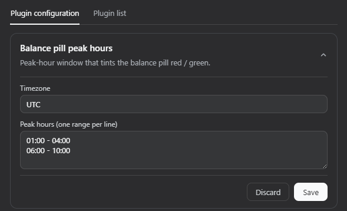

# dsh-balance-pill

DeepSeek Harness web plugin: a small, always-visible DeepSeek balance pill
(e.g. `CNY 42.17`). With a chat session open it sits in the session header;
without one it pins to the top-right corner of the app, so it is always on
screen. No dashboard, charts, or settings UI.

## Screenshots

Balance pill visible with and without a chat session (green = off-peak):


Peak-hours settings under **Settings → Plugins → Plugin configuration**:



## Layout

```
dsh-balance-pill/
  package.json       dual-face metadata (dsh.bundle + dsh.client), zero deps, no scripts
  cordis.patch.yml   bundle layer: inserts the Host row into the profile
  lib/index.js       Host half: credentials resolve + Node fetch + webserver route
  lib/client.js      Browser half: the pill in the header + shell.overlay fallback
  docs/              README screenshots
```

## How it works

- The Host half is a Cordis plugin row inserted by this package's
  `cordis.patch.yml` bundle layer. It injects the existing `credentials` and
  `webServer` services and registers one exact route, `/dsh-balance-pill`, on
  the web server.
- Per request the Host resolves `DEEPSEEK_API_KEY` through
  `credentials.resolve(...)`, calls
  `GET https://api.deepseek.com/user/balance` with Node's built-in `fetch`
  (Authorization: Bearer), and returns the minimum payload the UI needs:
  `{ "ok": true, "balance": 42.17, "currency": "CNY" }` or `{ "ok": false }`.
- The browser half registers the `BalancePill` React component (id
  `balance-pill`) twice. Inside a chat session it contributes to the
  `conversation.session.header.utilities` seat, so it rides the session
  header's flex row without ever covering the header's own controls. It also
  contributes to the frame-wide `shell.overlay` seat — an always-visible,
  additive layer — pinned to the top-right corner, but renders there **only
  while no session header exists** (no current session, or a still-blank
  one), so the pill is always on screen without duplicating or overlapping.
  It fetches the same-origin route on mount, every 60 seconds, and on click.
  Loaded state shows `CNY 42.17`; loading shows `…`; any failure shows a muted
  `–` — one neutral error state, no details.
- The Host half also registers one settings namespace, `dsh-balance-pill`
  (`settings.register`) holding the peak-hours config. The browser half edits
  that namespace through a card on the **Settings → Plugins → Plugin
  configuration** page and reads it to tint the pill; the settings service
  persists it to the profile's settings document (`~/.dsh/settings.yaml`), so
  the config survives reloads without editing or rebuilding the bundle.

## Peak-hours coloring

The pill shades the whole button by whether the user's current local time is
inside a configured peak-hours window:

- **Peak hours** → a subtle red tint.
- **Off-peak** → a subtle green tint.

The window is configurable from the UI, no rebuild needed: open **Settings →
Plugins → Plugin configuration**, expand **Balance pill peak hours**, set the
timezone and the ranges (one `HH:MM - HH:MM` per line), and **Save**. The config
persists to `~/.dsh/settings.yaml` (namespace `dsh-balance-pill`) and the pill
retints on the next check. The shape the UI edits is:

```js
{
  timezone: "UTC",
  peakHours: [
    ["01:00", "04:00"],
    ["06:00", "10:00"],
  ],
}
```

- The ranges are evaluated in `timezone`, then compared against the user's
  current local time (the local timezone is read from the browser via
  `Intl.DateTimeFormat().resolvedOptions().timeZone`).
- A range is inclusive of its start and exclusive of its end. A range whose end
  is at or before its start wraps across midnight to the next day, so
  `["23:00", "01:00"]` spans that whole window.
- DST transitions are handled (boundaries are resolved via Intl twice).
- The check runs on mount, every 60 seconds, and whenever the persisted config
  changes, so the tint stays current. It is independent of the balance fetch:
  the color reflects the peak status even while the balance is loading or
  unavailable.
- Invalid ranges are rejected by the card's validation; an empty `peakHours`
  list is always off-peak.

## Security posture

- The API key exists only in the Host process, in a local variable scoped to
  the single fetch, used solely for the Authorization header. It is never
  logged, persisted, serialized, or sent to the browser.
- The browser only ever receives `{ ok, balance, currency }` or `{ ok: false }`.
- The plugin reads no files directly (`.credentials.yaml` is owned by the
  `credentials` service) and spawns no processes.
- The only external network destination is `https://api.deepseek.com/user/balance`.

## Install

Requires a DeepSeek Harness web profile and a configured `DEEPSEEK_API_KEY`
(via the harness credentials service).

```bash
dsh plugin --profile web add github:ivbrajkovic/dsh-balance-pill
```

Then restart the web profile and reload the GUI. The bundle patch inserts the
Host row automatically; the browser half is picked up via `dsh.client`.

Pin a commit if you want a fixed revision:

```bash
dsh plugin --profile web add github:ivbrajkovic/dsh-balance-pill#<commit>
```

### Local development

From a checkout of this repo:

```bash
dsh plugin --profile web add link:$(pwd)
```

After edits, restart the web profile and reload the page. If the profile still
has a manual `balance-pill` row in its own `cordis.patch.yml`, remove that row
so the bundle layer is the only mount (avoids double-loading).

## Verify

1. Start or restart the web profile (`dsh web` / `pnpm dlx @deepseek-ai/dsh web`).
2. Open `http://localhost:3080` — the pill is always visible: pinned to the
   top-right corner while no session is open (e.g. `CNY 42.17`, or `–` if the
   key is missing), and inside the session header once a chat session is
   open, without covering any header controls.
3. Open **Settings → Plugins → Plugin configuration**, expand **Balance pill
   peak hours**, set timezone and ranges, **Save** — the pill retints on the
   next check (within 60s).
